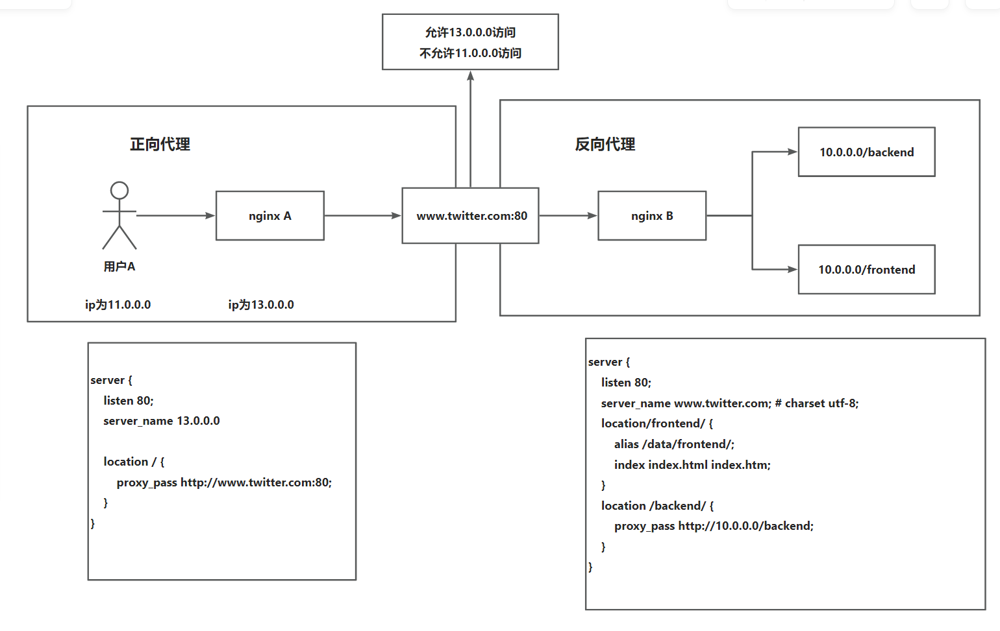
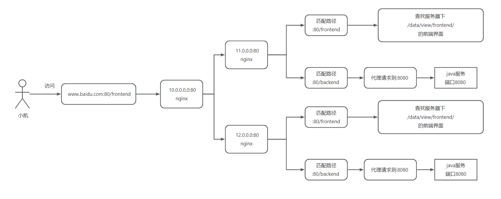

# nginx

## 1.正向代理和反向代理

参考博客 [漫画图解](https://cloud.tencent.com/developer/article/1418457)  
这个概念很容易混淆,先看下面这个图，区别还是挺明显的。  


虽然正向代理服务器和反向代理服务器所处的位置都是客户端和真实服务器之间，所做的事情也都是把客户端的请求转发给服务器，再把服务器的响应转发给客户端，但是二者之间还是有一定的差异的。


1、正向代理其实是客户端的代理，帮助客户端访问其无法访问的服务器资源。反向代理则是服务器的代理，帮助服务器做负载均衡，安全防护等。  
2、正向代理一般是客户端架设的，比如在自己的机器上安装一个代理软件。而反向代理一般是服务器架设的，比如在自己的机器集群中部署一个反向代理服务器。  
3、正向代理中，服务器不知道真正的客户端到底是谁，以为访问自己的就是真实的客户端。而在反向代理中，客户端不知道真正的服务器是谁，以为自己访问的就是真实的服务器。  
4、正向代理和反向代理的作用和目的不同。正向代理主要是用来解决访问限制问题。而反向代理则是提供负载均衡、安全防护等作用。二者均能提高访问速度。

## 2.配置文件导读

### 2.1 单机前后端文件
理想的情况如下


nginx配置
```nginx
# 只启动一个工作进程
worker_processes  1;    

# 每个工作进程的最大连接为1024                         
events {
    worker_connections  1024;               
}

http {
    # 引入MIME类型映射表文件
    include       mime.types;        
    # 全局默认映射类型为application/octet-stream            
    default_type  application/octet-stream;   

    server {
        # 监听80端口的网络连接请求
        listen       80;            
        # 虚拟主机名为localhost                  
        server_name  localhost;   
                 
        # 匹配前端访问的路径
        # 比如 访问localhost:80/frontend这个路由,nginx会匹配到这个路径,然后在alias的路径中找前端的界面，然后返回给浏览器
        location /frontend/ {
            alias  /data/view/frontend/;
            index index.html index.htm;
        }
        # 如果前端访问后端发起的http请求是localhost:80/backend/
        location /backend/{
             proxy_set_header Host $http_host;
             proxy_set_header X-Real-IP $remote_addr;
             proxy_set_header REMOTE-HOST $remote_addr;
             proxy_set_header X-Forwarded-For $proxy_add_x_forwarded_for;
             #核心配置代理接口到jar包的8080的项目上
             proxy_pass localhost:8080;
             proxy_set_header Upgrade $http_upgrade; 
        }           
    }
}
```
### 2.2 nginx高可用(主从 / 负载均衡)
实现nginx高可用需要多台服务器
```nginx
定义:
    10.0.0.0 作为负载均衡服务器  
    11.0.0.1 作为应用服务器A  
    11.0.0.1 作为应用服务器B
```
实现效果

10.0.0.0 的负载均衡的nginx配置
```nginx
worker_processes  1;

events {
    worker_connections  1024;
}

http {
    include       mime.types;
    default_type  application/octet-stream;
    sendfile        on;
    keepalive_timeout  65;

    upstream balanceServer {
        server 11.0.0.0:80;
        # 这里是主从配置,去掉backup就是轮询,可以设置weigh作为轮询的权重
        server 12.0.0.0:80 backup;
    }
    server {
        listen       80;
        server_name  10.0.0.0;

        location /frontend {
            proxy_pass   http://balanceServer/frontend/;
        }

        location /backend {
            proxy_pass   http://balanceServer/backend/;
        }
    }
}
```

11.0.0.0和12.0.0.0的负载均衡的nginx配置 两个配置文件一样
```nginx
# 只启动一个工作进程
worker_processes  1;    

# 每个工作进程的最大连接为1024                         
events {
    worker_connections  1024;               
}

http {
    # 引入MIME类型映射表文件
    include       mime.types;        
    # 全局默认映射类型为application/octet-stream            
    default_type  application/octet-stream;   

    server {
        # 监听80端口的网络连接请求
        listen       80;            
        # 虚拟主机名为localhost                  
        server_name  localhost;   
                 
        # 匹配前端访问的路径
        # 比如 访问localhost:80/frontend这个路由,nginx会匹配到这个路径,然后在alias的路径中找前端的界面，然后返回给浏览器
        location /frontend/ {
            alias  /data/view/frontend/;
            index index.html index.htm;
        }
        # 如果前端访问后端发起的http请求是localhost:80/backend/
        location /backend/{
             proxy_set_header Host $http_host;
             proxy_set_header X-Real-IP $remote_addr;
             proxy_set_header REMOTE-HOST $remote_addr;
             proxy_set_header X-Forwarded-For $proxy_add_x_forwarded_for;
             #核心配置代理接口到jar包的8080的项目上
             proxy_pass localhost:8080;
             proxy_set_header Upgrade $http_upgrade; 
        }           
    }
}
```
## 3.Docker安装 (还需完善)

推荐使用docker安装，简单快捷，需要注意2点  
1. nginx配置文件的里面写的路径是容器nginx中的路径，而不是服务器本身的路径
2. nginx配置文件里面的开放端口，需要在docker中也开放，否则无法访问

```shell 
# 创建拉取容器
docker pull nginx

# 创建挂载路径
mkdir -p /data/docker/project-volumes/nginx.conf
mkdir -p /data/docker/project-volumes/logs
mkdir -p /data/nginx/project-volumes/html

docker run -d \
  --name nginx \
  --restart always \
  -p 9467:9467 \
  -v /data/docker/project-volumes:/data/docker/project-volumes \
  -v ./conf/nginx.conf:/etc/nginx/nginx.conf \
  -v ./nginx/logs:/var/log/nginx \
  -v ./nginx/conf.d:/etc/nginx/conf.d \
  --build-arg context=. \
  --build-arg dockerfile=nginx-dockerfile \
  nginx
```

